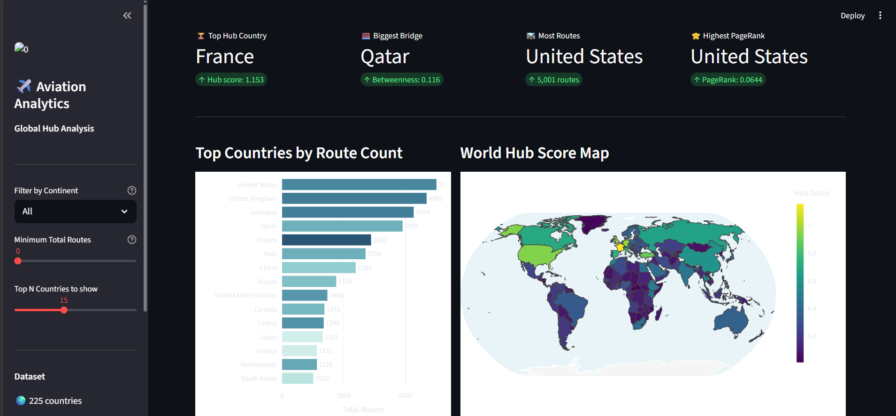

# ✈️ Global Aviation Hub Analytics

> A graph-based analytics platform analyzing **67,663 flight routes** across **237 countries** 
> using graph theory to identify the world's true aviation hub countries.


---

## 🔍 Project Overview

Most aviation analyses focus on individual airports — which airport is the busiest, which airline has the most routes. This project takes a different angle: **which countries are the true bridge hubs of global aviation?**

By aggregating 67,663 flight routes to the country level and applying graph theory, this project reveals that raw route counts alone are misleading. **Qatar**, for example, ranks outside the top 10 by route count — but has the **highest betweenness centrality** of any country, meaning it sits on more shortest paths between country pairs than France, Germany, or the USA combined.

---


## 🔗 Live Demo
 
---

## 🔑 Key Findings

| Finding | Detail |
|---|---|
| 🏆 Top Hub Country | **France** — hub score 1.153, connects to 227 countries |
| 🌉 Biggest Bridge | **Qatar** — highest betweenness centrality (0.116) |
| 🛣️ Most Routes | **United States** — 5,001 international routes |
| ⭐ Highest PageRank | **United States** — most prestigious connections |
| 🌍 Dominant Continent | **Europe** — 31,974 routes (3x more than Asia) |
| 🔗 Total Connections | **4,557** country-to-country aviation links |

---

## 📊 Dashboard Features

**5 Interactive Charts:**

1. **Top Countries Bar Chart** — horizontal bar chart colored by hub score
2. **World Choropleth Map** — countries filled by composite hub score
3. **Centrality Scatter Plot** — degree vs betweenness, bubble size = route count
4. **Network Graph** — top 20 hub countries and their connections
5. **Continent Flow Chart** — inter-continental route volumes

**Sidebar Filters:**
- Filter by continent
- Minimum route threshold slider
- Top N countries selector

**KPI Metrics:**
- Top hub country with score
- Biggest bridge country
- Most routes country
- Highest PageRank country

---

## 🛠️ Tech Stack

| Tool | Version | Purpose |
|---|---|---|
| Python | 3.10 | Core language |
| Pandas | latest | Data cleaning and EDA |
| NumPy | latest | Numerical operations |
| Neo4j | 2026.04 | Graph database storage |
| NetworkX | latest | Graph centrality analysis |
| SciPy | latest | PageRank computation |
| Plotly | latest | Interactive charts |
| Streamlit | latest | Live web dashboard |
| python-dotenv | latest | Environment variable management |

---

## 📁 Project Structure

```
traingraph-analytics/
│
├── data/                        # Data files (not tracked in git)
│   ├── airports.dat             # Raw OpenFlights airports data
│   ├── routes.dat               # Raw OpenFlights routes data
│   ├── airports_clean.csv       # Cleaned airports (7,698 rows)
│   ├── routes_clean.csv         # Cleaned international routes (34,765 rows)
│   ├── country_edges.csv        # Country-to-country connections (4,557 edges)
│   ├── country_stats.csv        # Per-country statistics (237 countries)
│   └── centrality_scores.csv   # NetworkX centrality results
│
├── notebooks/
│   ├── explore.py               # Initial data exploration
│   ├── clean.py                 # Data cleaning pipeline
│   ├── analysis.py              # EDA + NetworkX graph analysis
│   └── charts.py                # Standalone Plotly chart builder
│
├── src/
│   ├── app.py                   # Streamlit dashboard (main app)
│   └── load_neo4j.py            # Neo4j graph database loader
│
├── requirements.txt             # Python dependencies
├── .gitignore                   # Excludes .env and data files
└── README.md                    # This file
```

---

## ⚙️ How to Run Locally

### 1. Clone the repository
```bash
git clone https://github.com/neha-baby/traingraph-analytics.git
cd traingraph-analytics
```

### 2. Install dependencies
```bash
pip install -r requirements.txt
```

### 3. Download the dataset
Download these two files from OpenFlights and save them in the `data/` folder:
- airports: https://raw.githubusercontent.com/jpatokal/openflights/master/data/airports.dat
- routes: https://raw.githubusercontent.com/jpatokal/openflights/master/data/routes.dat

### 4. Clean the data
```bash
python notebooks/clean.py
```

### 5. Run the analysis
```bash
python notebooks/analysis.py
```

### 6. (Optional) Load into Neo4j
Create a `.env` file in the project root:
```
NEO4J_URI=bolt://localhost:7687
NEO4J_USER=neo4j
NEO4J_PASSWORD=your_password
```
Then run:
```bash
python src/load_neo4j.py
```

### 7. Launch the dashboard
```bash
streamlit run src/app.py
```

Open your browser at `http://localhost:8501`

---

## 📈 Graph Analysis Methodology

This project applies three centrality algorithms from graph theory:

**Degree Centrality**
Measures how many countries a country directly connects to, as a fraction of all possible connections. France scores highest — it connects to 227 out of 224 other countries in the network.

**Betweenness Centrality**
Measures how often a country sits on the shortest path between two other countries. Qatar scores highest despite its small size — its geographic position between Europe and Asia makes it a critical bridge. Removing Qatar would disrupt more international aviation paths than removing almost any other country.

**PageRank**
Google's original algorithm adapted for aviation networks. A country scores higher not just for having many connections, but for being connected to other important countries. The United States scores highest — it is connected to every major hub on every continent.

**Composite Hub Score**
The final hub score combines all three metrics into a single ranking, giving a complete picture of each country's importance in global aviation.

---

## 🗄️ Graph Database Design (Neo4j)

```
Nodes:    (Country) — 237 nodes
          Properties: name, airport_count, total_routes,
                      outgoing_routes, incoming_routes

Relationships: (Country)-[:CONNECTS_TO]->(Country) — 4,557 edges
               Properties: route_count
```

Sample Cypher query — find top connected countries:
```cypher
MATCH (c:Country)
RETURN c.name AS country, c.total_routes AS routes
ORDER BY routes DESC
LIMIT 10
```

---

## 📋 Data Source

**OpenFlights** — open aviation data
- airports.dat — 7,698 airports worldwide
- routes.dat — 67,663 flight routes

Source: https://openflights.org/data.html
License: Open Database License (ODbL)

---

## 👤 Author

**neha-baby** — transitioning from Machine Learning to Data Analytics

This project was built as a portfolio piece demonstrating:
- Graph database design with Neo4j
- Network analysis with NetworkX  
- Interactive dashboard development with Streamlit
- Data cleaning and EDA with Pandas

---

*Built with Python · Pandas · Neo4j · NetworkX · Plotly · Streamlit*
